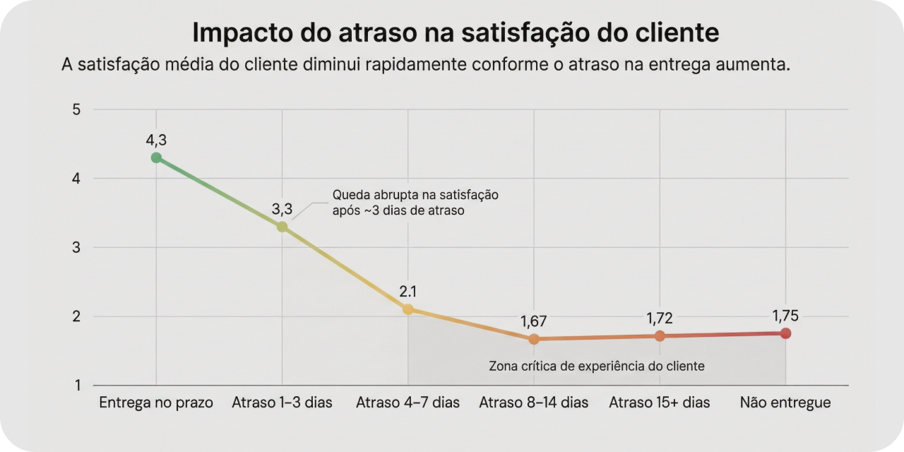

# DelayImpact Analytics

**Diagnóstico analítico do impacto de atrasos logísticos na satisfação do cliente em operações de e-commerce.**




---

# Visão Geral

A **DelayImpact Analytics** é uma **Proof of Concept (POC)** que investiga como **atrasos logísticos impactam a satisfação do cliente em operações de e-commerce**.

A análise parte de dados operacionais, logísticos, financeiros e de experiência do cliente para construir uma **base analítica confiável** e conduzir um diagnóstico orientado a negócio.

O objetivo da POC não é realizar modelagem preditiva, mas compreender o problema e responder à pergunta:

> *Em que situações o atraso logístico passa a afetar significativamente a satisfação do cliente e onde esforços de melhoria devem ser priorizados?*

---

# Problema de Negócio

A experiência de entrega é um dos fatores mais relevantes para a satisfação do cliente em e-commerce.

Mesmo atrasos relativamente pequenos podem gerar:

* avaliações negativas
* aumento de detratores
* deterioração da percepção da marca
* impacto indireto em retenção e recompra

No entanto, **nem todo atraso produz o mesmo efeito**.

A DelayImpact busca identificar:

* em que intensidade de atraso a satisfação começa a deteriorar
* quais segmentos são mais sensíveis ao atraso
* se existem diferenças regionais no impacto da entrega
* onde melhorias logísticas tendem a gerar maior retorno operacional

---

# Abordagem da Solução

A POC segue uma abordagem analítica em camadas, simulando a estrutura de um pipeline analítico realista.

### Curadoria de Dados (Silver)

* padronização e validação dos dados
* criação de views intermediárias
* consolidação de dados operacionais e de pedidos

---

### Camada Gold Analítica

* consolidação das informações em nível de pedido
* integração de dados logísticos, financeiros e de satisfação
* criação de métricas e features analíticas

Essa camada funciona como **base única para diagnóstico analítico**.

---

### Análise Exploratória Guiada

A análise exploratória é conduzida com foco em hipóteses de negócio, investigando relações entre:

* atraso logístico
* satisfação do cliente
* categoria de produto
* região de entrega

---

### Síntese Analítica

Os principais achados são consolidados em insights claros voltados ao suporte à decisão operacional.

---

# Relatório Executivo

Os resultados da análise foram consolidados em um **relatório executivo orientado a decisão**.

[📄 **Relatório completo**](reports/executive_summary.md)

O relatório apresenta:

* impacto do atraso na satisfação do cliente
* risco associado ao aumento de detratores
* diferenças regionais de sensibilidade ao atraso
* recomendações analíticas para priorização logística

---

# Dataset

**Fonte:** Olist E-commerce Dataset (Kaggle)
**Contexto:** marketplace brasileiro de e-commerce
**Período:** 2016–2018

Os dados são utilizados exclusivamente como **meio demonstrativo**.

O dataset foi adaptado para uma arquitetura analítica em camadas utilizando **DuckDB**.

---

# Pipeline Analítico

O fluxo de dados da POC segue três etapas principais.

### Ingestão

* conversão dos dados brutos (CSV) para **DuckDB**
* criação de um banco versionado utilizado como fonte oficial

---

### Curadoria

* transformação dos dados via SQL
* criação de views analíticas intermediárias

---

### Camada Gold

* consolidação dos dados em **nível de pedido**
* criação de métricas analíticas
* preparação para análise exploratória

---

# Estrutura do Projeto

```id="v0n8n3"
delayimpact-analytics/

├── data/
│   ├── raw/
│   │   └── olist.zip
│   └── processed/
│       └── olist.duckdb
│
├── imangens/
│   ├── delayimpact-results.png
│   ├── detractors_by_state.png
│   ├── detractors_vs_delay_bucket.png
│   └── score_vs_delay_bucket.png
│ 
├── notebooks/
│   ├── 01_curadoria_sql.ipynb
│   ├── 02_gold_delay_satisfaction.ipynb
│   └── 03_eda_delay_satisfaction.ipynb
│
├── scripts/
│   └── ingest_olist_to_duckdb.py
│
├── src/
│   └── paths.py
│
├── reports/
│   └── executive_summary.md
│
├── requirements.txt
└── README.md
```

---

# Tecnologias Utilizadas

* Python
* SQL
* DuckDB
* Pandas
* Análise Exploratória de Dados (EDA)
* Análise Estatística
* Visualização de Dados

---

# Resultados

A DelayImpact demonstra como dados operacionais podem ser estruturados para apoiar decisões logísticas orientadas à experiência do cliente.

A POC entrega:

* base analítica consolidada em nível de pedido
* diagnóstico do impacto de atrasos na satisfação
* identificação de segmentos mais sensíveis ao atraso
* evidências analíticas para priorização logística
* relatório executivo voltado à tomada de decisão

---

# Status

**POC concluída**

* dados curados
* camada Gold analítica construída
* análise exploratória guiada finalizada
* relatório executivo disponível

---

# Disclaimer

Esta POC foi desenvolvida exclusivamente para fins demonstrativos.

As análises e recomendações apresentadas têm caráter ilustrativo e não devem ser utilizadas diretamente como base para decisões operacionais em ambiente produtivo.

---

# Explore outros projetos do Small Data Lab

Este projeto faz parte do **Small Data Lab**, um laboratório técnico dedicado à experimentação aplicada em dados, analytics e sistemas de IA.

Explore também outras POCs do laboratório:

- [LakeFlow](https://github.com/smalldatalabbr/lakeflow) — Pipeline Lakehouse para ingestão e organização de dados externos.  
- [RetailLens BI](https://github.com/smalldatalabbr/retaillens-bi) — Camada analítica BI-ready para diagnóstico operacional em e-commerce.    
- [CampaignSense](https://github.com/smalldatalabbr/campaignsense) — CRM Analytics para priorização de campanhas baseada em propensão e ROI.  
- [FraudWatch](https://github.com/smalldatalabbr/fraudwatch) — Sistema de decisão antifraude que transforma scores de ML em políticas operacionais auditáveis.  
- [DocLens](https://github.com/smalldatalabbr/doclens) — Chatbot RAG com guardrails e testes adversariais para governança de LLMs.


---

## Onde me encontrar

[Portfólio](https://jhonathan.me) | [LinkedIn](https://www.linkedin.com/in/jhonathandomingues) | [Email](mailto:hello@jhonathan.me)

---

Este repositório é licenciado sob a MIT License.