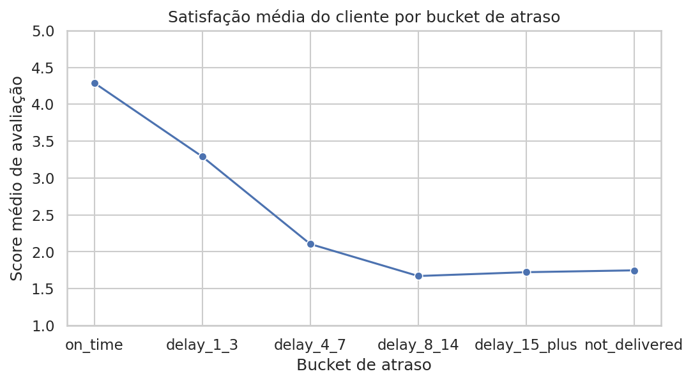
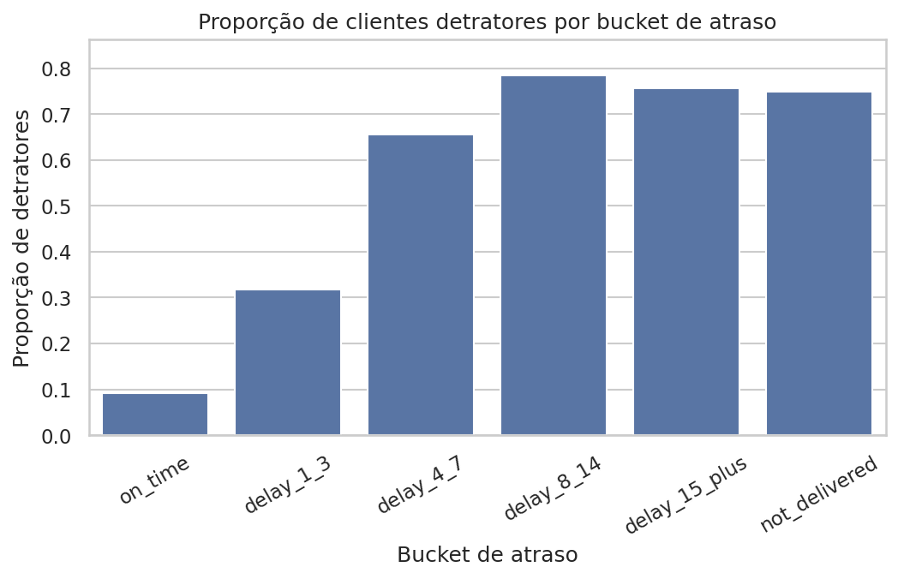
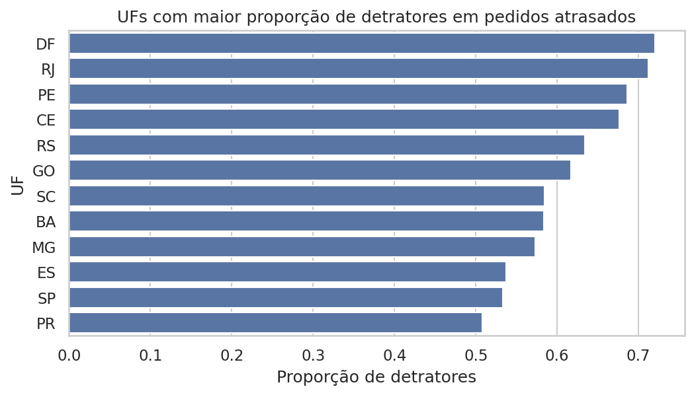

# DelayImpact Analytics
Diagnóstico de atraso logístico e impacto na satisfação do cliente

## Contexto

A experiência de entrega é um dos principais fatores de satisfação em operações de e-commerce.  
Mesmo em cenários onde a maior parte dos pedidos é entregue dentro do prazo, atrasos pontuais podem gerar impacto desproporcional na percepção do cliente, influenciando avaliações, comentários e indicadores de reputação.

Esta Proof of Concept (POC) analisa dados de pedidos, entregas e avaliações de um e-commerce para compreender de forma diagnóstica como o atraso logístico afeta a satisfação do cliente, com foco em apoiar decisões de priorização operacional e mitigação de risco reputacional.

---

## Pergunta de Negócio

A análise busca responder às seguintes questões:

- Qual é o impacto do atraso na avaliação média dos clientes?
- Existe um ponto a partir do qual pequenos atrasos geram quedas acentuadas de satisfação?
- Como o atraso influencia a proporção de clientes insatisfeitos (detratores)?
- O impacto do atraso é homogêneo entre diferentes regiões?
- Onde faz mais sentido priorizar esforços de melhoria logística?

---

## Abordagem Analítica

A análise foi conduzida a partir de uma base de dados curada em nível de pedido, construída previamente em uma camada Gold analítica.  
O foco foi restrito a variáveis diretamente relacionadas ao atraso logístico e à experiência do cliente, evitando correlações artificiais e mantendo clareza interpretativa.

A abordagem adotada é de **Análise Exploratória Guiada**, estruturada por hipóteses e orientada à geração de insights acionáveis, sem uso de modelos preditivos ou técnicas de machine learning.

---

## Principais Resultados

### Impacto do atraso na satisfação do cliente

A análise do score médio de avaliação por bucket de atraso revela uma relação clara e não linear entre tempo de entrega e satisfação do cliente.

Pedidos entregues no prazo apresentam nível elevado de satisfação, com score médio superior a 4. No entanto, atrasos curtos, entre 1 e 3 dias, já resultam em uma queda significativa na avaliação, próxima de um ponto completo na escala de 1 a 5.

A partir de atrasos entre 4 e 7 dias, observa-se um colapso acentuado da satisfação, com scores médios próximos de 2. A partir desse patamar, atrasos mais longos não agravam substancialmente a avaliação, indicando que o dano à experiência do cliente ocorre de forma precoce.

Esse padrão sugere a existência de um ponto crítico de inflexão, no qual pequenos aumentos no atraso geram impactos desproporcionais na percepção do serviço.

---

### Atraso como gerador de detratores

Ao analisar a proporção de clientes classificados como detratores por nível de atraso, observa-se uma intensificação expressiva do impacto negativo na experiência do cliente.

Pedidos entregues no prazo apresentam baixa incidência de detratores, indicando uma operação saudável sob a ótica da satisfação. No entanto, atrasos curtos já triplicam essa proporção, enquanto atrasos a partir de 4 a 7 dias fazem com que clientes insatisfeitos se tornem maioria.

A partir desse patamar, o risco reputacional se mantém elevado, com proporções semelhantes de detratores em atrasos mais longos e em pedidos não entregues. Esse comportamento reforça que o dano à percepção do serviço ocorre de forma precoce, transformando o atraso em um fator crítico de insatisfação explícita.

---

### Diferenças regionais de impacto

A análise por estado indica que o impacto do atraso logístico na satisfação do cliente não é uniforme entre as regiões.  
Mesmo considerando apenas pedidos atrasados, observa-se variação significativa na proporção de detratores entre os estados.

Algumas regiões apresentam níveis mais elevados de insatisfação, sugerindo maior sensibilidade à experiência de entrega, enquanto outras demonstram impacto relativo menor para atrasos de mesma intensidade.  
Esse padrão reforça que estratégias de mitigação de atraso podem se beneficiar de priorização geográfica, concentrando esforços onde o risco reputacional é mais elevado.

---

## Recomendações Analíticas

Com base nos padrões identificados, a análise sugere as seguintes direções analíticas para apoio à tomada de decisão:

- Priorizar a mitigação de atrasos ainda nos primeiros dias, onde o impacto na satisfação se intensifica de forma abrupta.
- Tratar atrasos acima de 4 a 7 dias como eventos críticos de experiência do cliente, dada a elevada associação com detratores.
- Monitorar pedidos com risco de não entrega como categoria prioritária de impacto reputacional.
- Incorporar a dimensão regional na priorização de ações logísticas, concentrando esforços em regiões mais sensíveis ao atraso.
- Utilizar intensidade de atraso, e não apenas volume de pedidos, como critério de priorização operacional.
